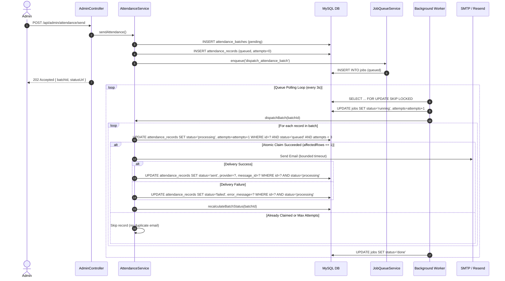

# APFRS Attendance Dispatch Reliability Architecture & State Machine

## 1. Overview & Delivery Semantics
The Attendance and Faculty Reporting System (APFRS) operates under an **at-least-once durable job processing architecture with application-level deduplication and atomic state transitions**.

Because external SMTP mail transfer agents and HTTP APIs (such as Resend) can experience network partitions after accepting an email message but before the confirmation ACK is received, absolute external *exactly-once* network delivery is impossible across distributed physical systems. To prevent duplicate emails, APFRS enforces:
1. **Durable MySQL Job Queueing** (`jobs` table with `FOR UPDATE SKIP LOCKED`).
2. **Atomic Compare-And-Swap Database State Transitions** on `attendance_records`.
3. **Application-Level Idempotency Keys** (monthly/annual faculty uniqueness lookup before transmission).
4. **Bounded Exponential Backoff Retries** with hard-coded max attempt ceiling ($N = 3$).

---

## 2. Finite State Machine (FSM)

### Attendance Record State Machine
```
   ┌─────────┐
   │ queued  │ ◄─────────────────────────┐
   └────┬────┘                           │ (manual retry / crash recovery
        │ (atomic claim:                 │  if attempts < 3)
        │  WHERE status = 'queued'       │
        │  AND attempts < 3)             │
        ▼                                │
   ┌─────────────┐                       │
   │ processing  │ ──────────────────────┘
   └────┬────┬───┘   (provider error / PDF error / crash with attempts >= 3)
        │    │
(email  │    └───────────────────────────┐
sent ok)│                                │
        ▼                                ▼
   ┌─────────┐                     ┌──────────┐
   │  sent   │                     │  failed  │
   └─────────┘                     └──────────┘
(Terminal State)             (Terminal if attempts >= 3)
```

### Attendance Batch Derived States
| Batch State | Definition / Invariant | Completed At |
| :--- | :--- | :--- |
| `pending` | `total === 0` OR `queued === total` | `NULL` |
| `processing` | `processing > 0` OR (`sent + failed > 0` AND `sent + failed < total`) | `NULL` |
| `completed` | `sent === total` AND `total > 0` | Timestamp |
| `partial_failed` | `sent + failed === total` AND `sent > 0` AND `failed > 0` | Timestamp |
| `failed` | `failed === total` AND `total > 0` | Timestamp |

---

## 3. Concurrency & Queue Processing Model



---

## 4. Failure & Recovery Protocols

### 1. Worker Crash During Email Sending
- **Symptom**: Process dies while a record is in `status = 'processing'`.
- **Mitigation**: On server startup or lease expiry tick, the recovery routine executes:
  ```sql
  UPDATE attendance_records
  SET status = 'queued', error_message = 'Reset after server restart / crash recovery', updated_at = NOW()
  WHERE status = 'processing' AND attempts < 3 AND updated_at < DATE_SUB(NOW(), INTERVAL ? SECOND);
  ```
  Items exceeding max attempts are marked `status = 'failed'`.

### 2. Manual Item Retry (`POST /api/admin/attendance/records/:recordId/retry`)
- **Guardrails**:
  - Enforces `attempts < 3`.
  - Rejects if record is already `sent` (400) or currently `processing` (409).
  - Idempotently succeeds without duplicate queue spam if already `queued`.
  - Transmits `targetRecordId` to prevent full batch re-execution.

### 3. External Network Latency / Provider Hangs
- **Guardrails**:
  - Resend HTTP calls bound by `AbortSignal.timeout(timeoutMs)`.
  - SMTP socket, greeting, and connection timeouts enforced.
